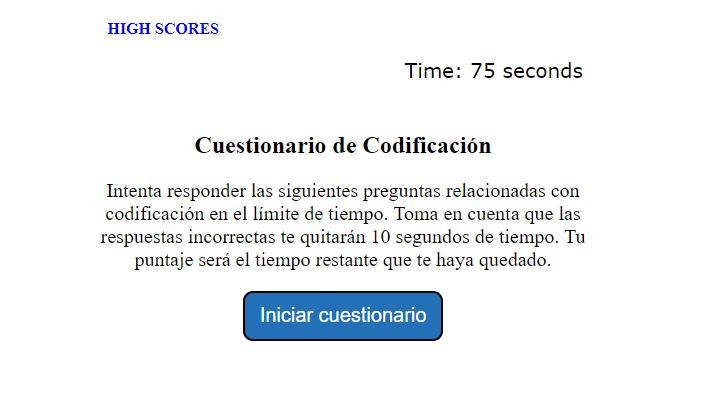
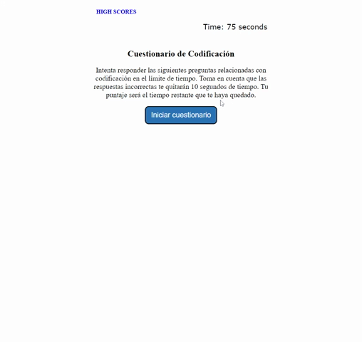

# Cuestionario-de-Codificacion

## En este cuarto desafío se ha creado un quiz o cuestionario de codificación que cumple con la siguiente funcionalidad:

* La aplicación consiste en un cuestionario de codificación cronometrado.
* El usuario cuenta con 75 segundos para completarlo.
* El cuestionario cuenta con 7 preguntas de opción múltiple; hay cuatro opciones de respuesta.
* Cuando se da clic en el botón de "Iniciar cuestionario", el cronómetro inicia y comienzan a presentarse las preguntas.
* Cada vez que se contesta una pregunta, se muestra la siguiente pregunta con el resultado de la pregunta anterior.
* Cada vez que se responde una pregunta incorrectamente, se restan 10 segundos al cronómetro.
* Si todas las preguntas son respondidas o el cronómetro llega a cero, el cuestionario se termina.
* La puntuación final será igual al tiempo que haya quedado en el cronómetro.
* Cuando termina el cuestionario, el usuario puede guardar sus iniciales y puntaje.
* Las iniciales y puntaje del usuario se guardarán en los "HIGH SCORES".
* Además, el puntaje  solamente se podrá guardar si el usuario introduce algo en el campo de las iniciales.
* Los puntajes desplegados en "HIGH SCORES" se despliegan de mayor a menor.
* La aplicación ofrece la opción de limpiar los puntajes desplegados en "HIGH SCORES".

## Se puede acceder a la aplicación por medio del siguiente link:

* [Link a aplicación](https://jorgeramirezanzaldo.github.io/Cuestionario-de-Codificacion/)

## La aplicación luce tal como se muestra en la siguiente imagen:

## A continuación se presenta una animación sobre el funcionamiento de la aplicación:

